<div align="center">
  
  <p>Кастомный DDNet-клиент на базе TClient/DDNet: комфорт, кастомизация, социальные системы и QoL для соревновательной игры.</p>

  <p>
    <a href="https://bestclient.fun"></a>
    <a href="https://t.me/bestddnet"></a>
    <a href="https://discord.gg/bestclient"></a>
  </p>
</div>

## О проекте

BestClient — это форк DDNet с собственным стеком фич, а не просто reskin. Клиент добавляет визуальные эффекты, инструменты ввода, голосовой чат, редакторы, социальные системы и мини-игры, оставаясь совместимым с DDNet-серверами.

Сейчас в клиенте **278** переменных `bc_*`, пять вкладок настроек BestClient, встроенный голосовой чат, HUD-редактор, кланы, совместный маппинг, Fast Practice и вкладка Fun с мини-играми.

## Ссылки

- Сайт: [bestclient.fun](https://bestclient.fun)
- Telegram: [t.me/bestddnet](https://t.me/bestddnet)
- Discord: [discord.gg/bestclient](https://discord.gg/bestclient)

## Скриншоты

### Главное меню

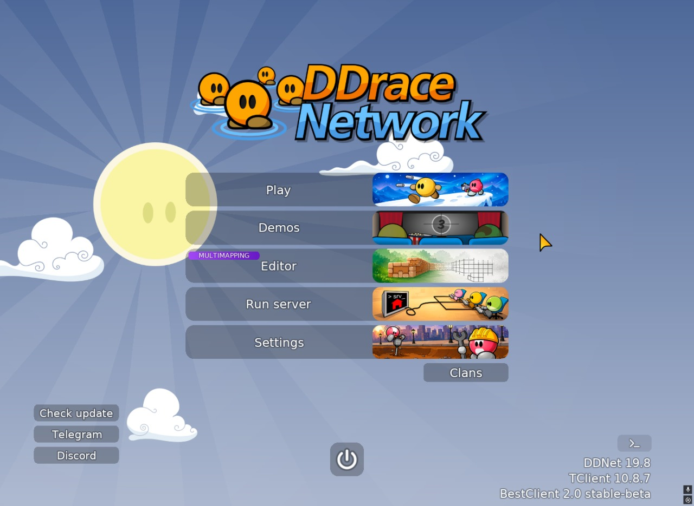

Анимация кнопок при наведении, быстрый доступ к Play/Editor/Demo/Settings и бейдж **MULTIMAPPING** на кнопке редактора.

### Настройки BestClient — все вкладки

#### Visuals

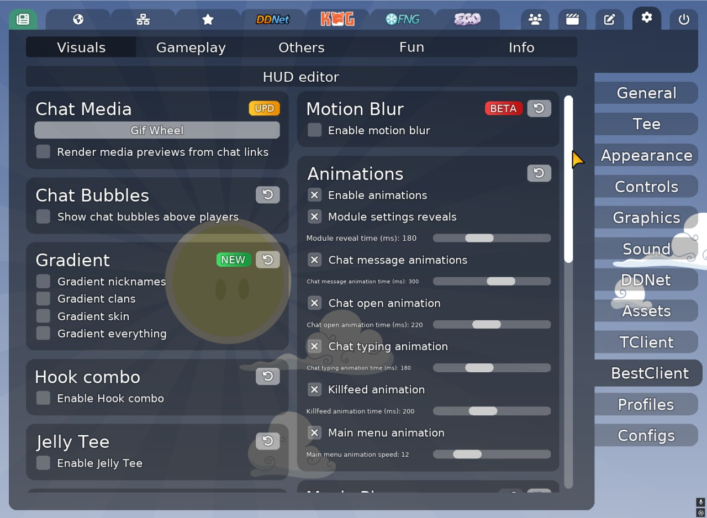
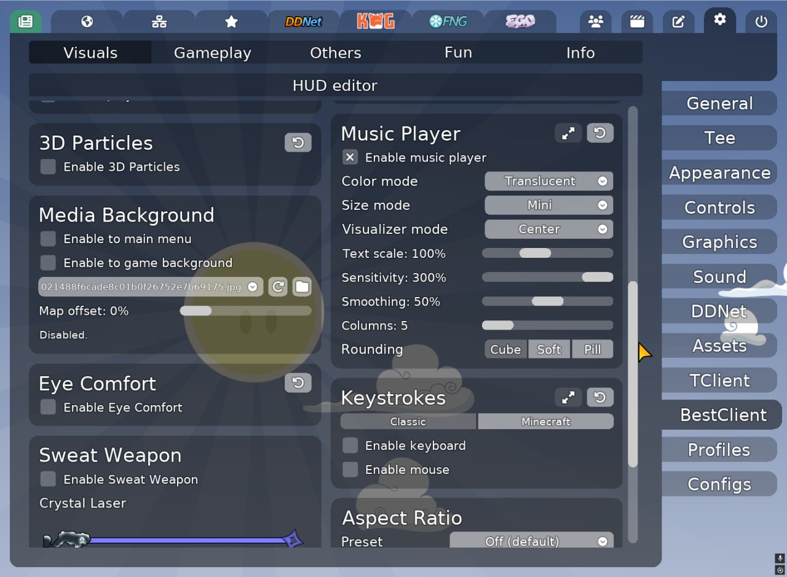
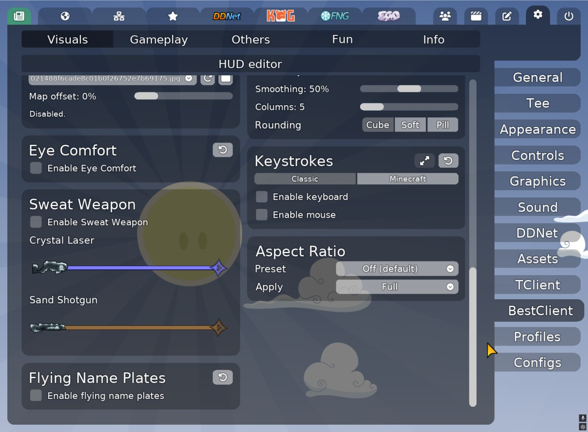

Chat Media, Gif Wheel, градиенты ников, Hook Combo, Jelly Tee, 3D Particles, Media Background, Eye Comfort, Sweat Weapon, Flying Name Plates, Motion Blur, Animations, Music Player, Keystrokes, Custom Aspect Ratio, Chat Bubbles и кнопка **HUD editor**.

#### Gameplay

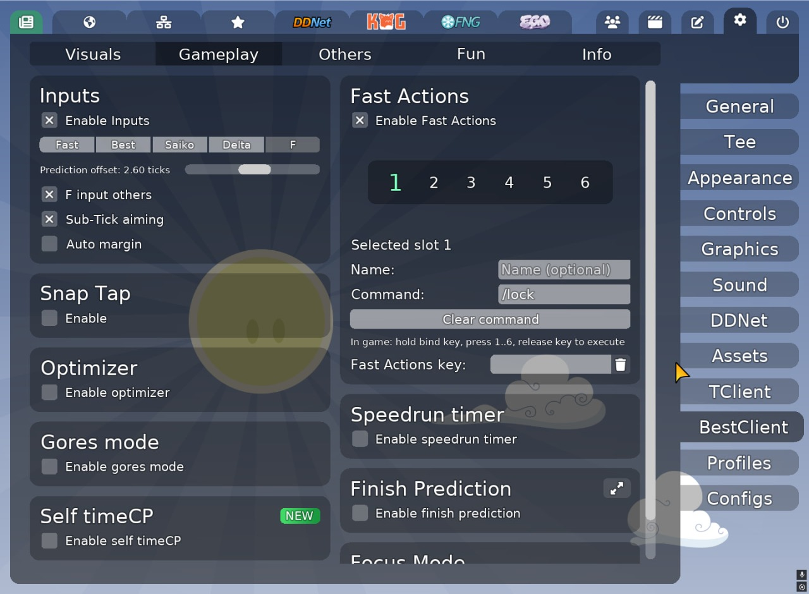

Inputs (Fast / Best / Saiko / Delta / F), Snap Tap, Optimizer, Gores mode, Self timeCP, Fast Actions, Speedrun timer, Finish Prediction, Focus Mode.

#### Others

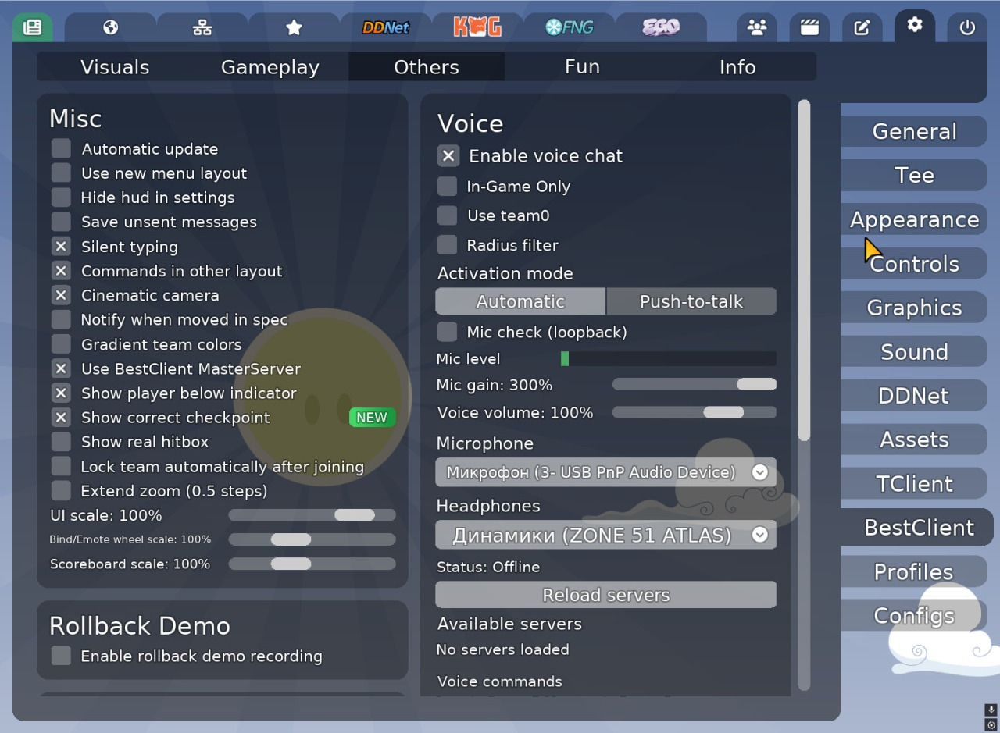
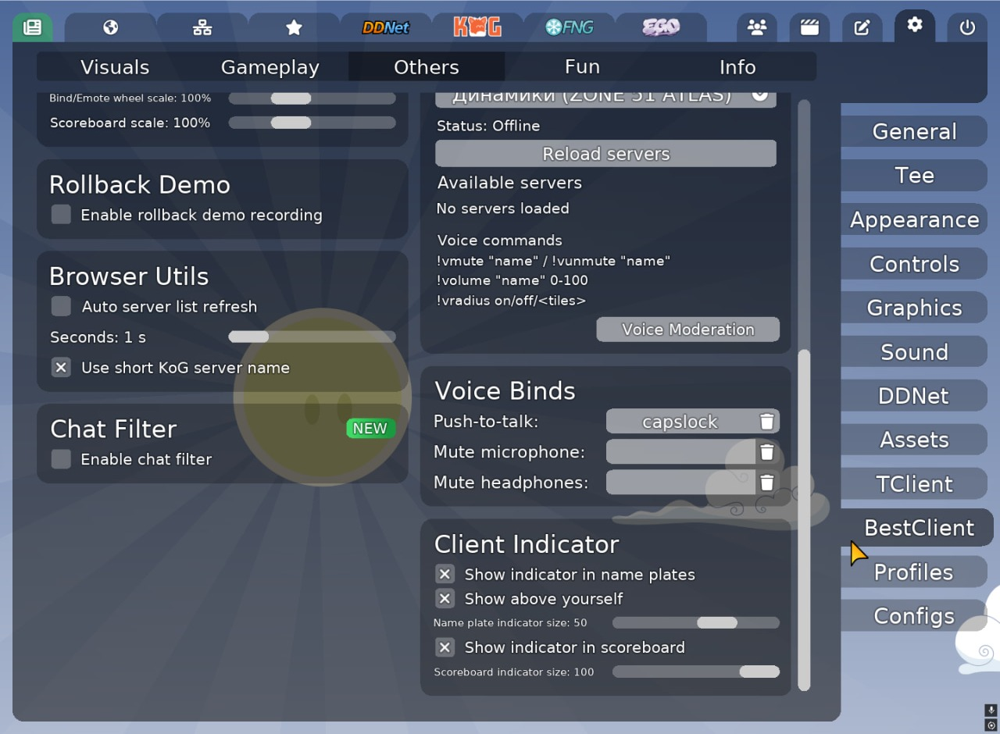

Misc, Rollback Demo, Browser Utils, Chat Filter, Voice Binds, Client Indicator.

#### Fun

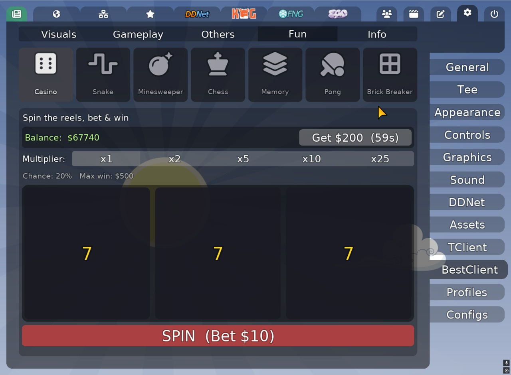

Casino, Snake, Minesweeper, Chess, Memory, Pong, Brick Breaker.

#### Info

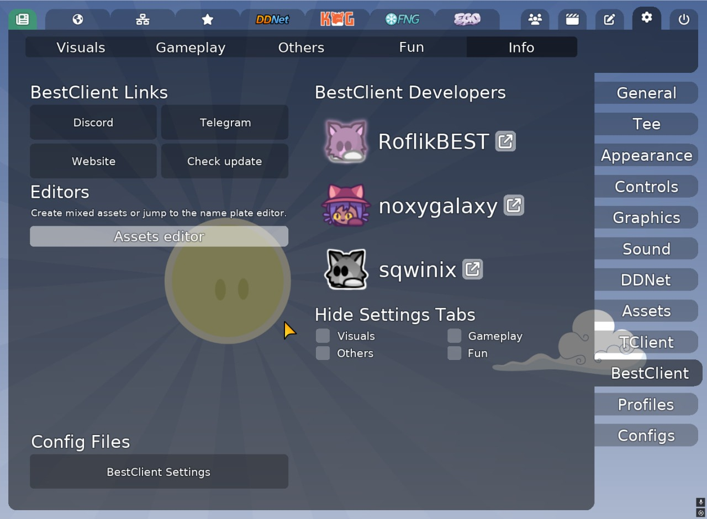

Ссылки, Assets editor, конфиг-файлы, разработчики, скрытие вкладок настроек.

## Ключевые системы

### Clans

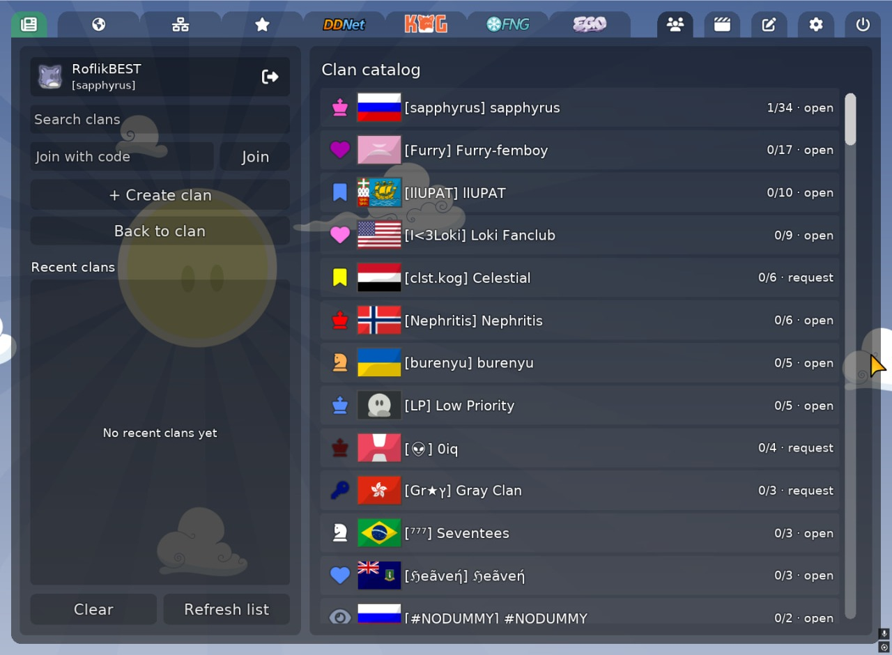

Встроенная система кланов с отдельной страницей в меню клиента.

- Регистрация и вход по нику/паролю
- Создание клана, каталог, превью и вступление (open / apply / invite code)
- Роли: Member, Veteran, Vice-President, President
- Заявки, объявления, уведомления и unread-бейдж на кнопке меню
- Онлайн-статус участников, «unleashed» игроки на серверах
- Синхронизация клан-тега в игре и cooldown на смену клана/объявлений

Конфиг: `bc_clans_enabled`, `bc_clans_api_url`, `bc_clans_unread_badge`, `bc_clans_allow_local_dev`.

### Multimapping

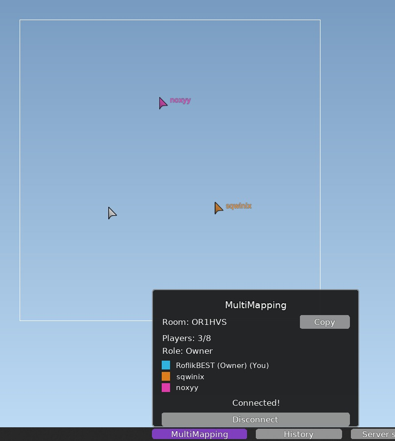

Совместное редактирование карт прямо в редакторе DDNet.

- Создание комнаты или вход по коду
- Несколько участников с live-курсорами и цветными слотами
- Синхронизация тайлов, слоёв, квадов, групп, images/sounds, tune/switch/tele/speedup
- Full sync, map transfer для late join, ping/pong и e2e latency
- Бейдж **MULTIMAPPING** на кнопке Editor в главном меню

### Fast Practice

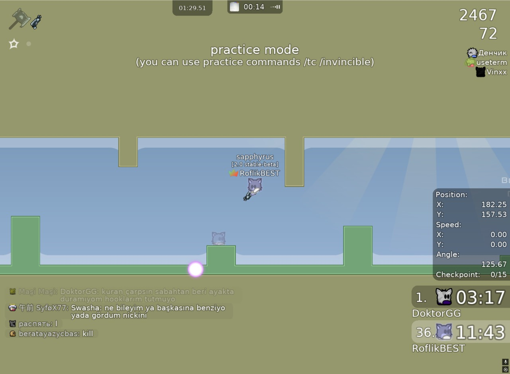

Локальный practice-режим с отдельным predicted world и dummy ghost.

- Переключение из ingame-меню или консолью: `fast_practice_toggle`
- Practice-команды в team chat (`/rescue`, `/tp`, `/weapon`, `/invincible`, `/deep`, `/hit others` и др.)
- Ghost другого tee, anchor-сохранение, visual fast input prediction
- Требует dummy на сервере; перехватывает kill и practice chat-команды

### HUD Editor

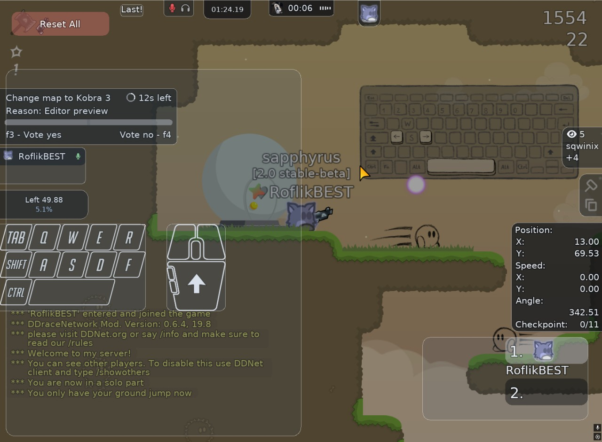

Live-редактор расположения HUD-модулей поверх игры или демо.

- Drag & drop и resize угловых хватов
- Модули: Score, Movement Info, Dummy Actions, Local Time, Spectator Count, Frozen HUD, Chat, Votes, Finish Prediction, Music Player, Keystrokes, Voice HUD / mute icons
- Per-module reset position/scale, Reset All с анимацией
- Позиции сохраняются в `bc_hud_*` конфиги

## Обзор функций

### Visuals

- **Chat Media** — превью фото/GIF из ссылок в чате, фильтр доменов, Gif Wheel, CherryGifs, gif bubble над головой
- **Gradient** — градиентные ники, кланы, скины и весь текст (skin / custom / rainbow)
- **Hook Combo** — popup и звук комбо (hook / hammer / both)
- **Jelly Tee** — деформация tee (self / others)
- **3D Particles** — кубы/сердца/mixed, glow, push от игрока
- **Media Background** — видео/картинка в меню и ingame background
- **Eye Comfort** — тёплый оверлей для глаз
- **Sweat Weapon (Crystal Laser)** — кристаллы на laser/shotgun
- **Flying Name Plates** — «воздушные» неймплates
- **Motion Blur** — смешивание с предыдущим кадром (BETA)
- **Animations** — UI reveal, chat/killfeed/main menu анимации
- **Music Player** — HUD-плеер с visualizer и цветами обложки
- **Keystrokes** — Classic / Minecraft HUD клавиатуры и мыши
- **Custom Aspect Ratio** — пресеты и произвольный num:den
- **Chat Bubbles** — пузыри над игроками

Demo-only (в Demo Player): **Camera Drift**, **Dynamic FOV**.

### Gameplay

- **Inputs** — Fast, Best (smoothing/latency/interpolation), Saiko, Delta, F + Auto Margin
- **Snap Tap** — мгновенное переключение A/D (с community blocklist)
- **Optimizer** — отключение particles, FPS Fog, приоритеты процессов
- **Gores mode** — entity-like режим с auto-disable при оружии
- **Self timeCP** — личные чекпоинты (tee / cursor placement)
- **Fast Actions** — быстрый селектор команд
- **Speedrun timer** — таймер с H/M/S/ms
- **Finish Prediction** — прогноз финиша на карте
- **Focus Mode** — скрытие отвлекающих HUD/UI элементов
- **45° / Small Sens** quick binds (через binds)

### Others

- **Misc** — auto update, layout, silent typing, cinematic camera, spec moved notify, extend zoom, UI/wheel/scoreboard scale и др.
- **Rollback Demo** — replay rollback с настраиваемой длиной
- **Browser Utils** — auto refresh списка серверов, short KoG names
- **Chat Filter** — regex/censor list, whitelist игроков
- **Voice Binds** — push-to-talk и voice moderation key
- **Client Indicator** — иконка BestClient в nameplate/scoreboard + browser filter

### Отдельные системы (вне вкладок BestClient)

- **Voice Chat** — Opus PTT/VAD, radius/team0, per-player volume/mute, voice mod tab в admin panel
- **Admin Panel** — say/broadcast/mute/ban/kick/respawn/pause + Voice moderation
- **Translate** — авто-перевод входящего/исходящего чата (кнопка в chat UI)
- **Clans**, **Multimapping**, **Fast Practice**, **Assets Editor**, **Casino + мини-игры**

### Удалено (больше не в клиенте)

Afterimage, Raycast, Player Trail, Magic Particles, Orbit Aura, Graffiti, ReShade tab, BestClient Shop, Components editor и часть старых мини-игр (2048, Tetris, Tic-Tac-Toe и др.).

## Сборка

Инициализация submodules:

```bash
git submodule update --init --recursive
```

Быстрая сборка:

```bash
cmake -S . -B build -G Ninja -DCMAKE_BUILD_TYPE=Debug -DDEV=ON -DVULKAN=ON
cmake --build build --target everything
```

CI-like сборка:

```bash
cmake -S . -B build -G Ninja -DCMAKE_BUILD_TYPE=Debug -DDOWNLOAD_GTEST=ON -DDEV=ON
cmake --build build --target everything
```

Тесты:

```bash
cmake --build build --target run_tests
```

Headless:

```bash
cmake -S . -B headless -G Ninja -DHEADLESS_CLIENT=ON -DCMAKE_BUILD_TYPE=Debug -DDOWNLOAD_GTEST=ON -DDEV=ON
cmake --build headless --target run_tests
```

## Полный список `bc_*` конфигов

Источник: `src/engine/shared/config_variables_bestclient.h` (278 переменных).

<details>
<summary>Развернуть полный список</summary>

```cfg
bc_3d_particles
bc_3d_particles_alpha
bc_3d_particles_collide
bc_3d_particles_color
bc_3d_particles_color_mode
bc_3d_particles_count
bc_3d_particles_depth
bc_3d_particles_fade_in_ms
bc_3d_particles_fade_out_ms
bc_3d_particles_glow
bc_3d_particles_glow_alpha
bc_3d_particles_glow_offset
bc_3d_particles_push_radius
bc_3d_particles_push_strength
bc_3d_particles_size_max
bc_3d_particles_size_min
bc_3d_particles_speed
bc_3d_particles_type
bc_3d_particles_view_margin
bc_animations
bc_auto_margin
bc_auto_server_list_refresh
bc_auto_server_list_refresh_seconds
bc_auto_team_lock
bc_auto_team_lock_delay
bc_auto_update
bc_best_input_amount
bc_best_input_interpolation
bc_best_input_latency_comp
bc_best_input_others
bc_best_input_smoothing
bc_bestclient_settings_tabs
bc_blocked_content_partial_replacement_char
bc_blocked_content_replacement_char
bc_blocked_word_console_color
bc_camera_drift
bc_camera_drift_amount
bc_camera_drift_reverse
bc_camera_drift_smoothness
bc_casino_balance
bc_casino_last_claim
bc_chat_alt_command_layout
bc_chat_animation
bc_chat_animation_ms
bc_chat_animation_type
bc_chat_bubble_animation
bc_chat_bubble_bg_color
bc_chat_bubble_custom_colors
bc_chat_bubble_fadein
bc_chat_bubble_fadeout
bc_chat_bubble_outline_color
bc_chat_bubble_rounding
bc_chat_bubble_showtime
bc_chat_bubble_size
bc_chat_bubble_text_color
bc_chat_bubbles
bc_chat_bubbles_demo
bc_chat_bubbles_self
bc_chat_media_allowed_domains
bc_chat_media_content_filter
bc_chat_media_gifs
bc_chat_media_photos
bc_chat_media_preview
bc_chat_media_preview_max_width
bc_chat_open_animation
bc_chat_open_animation_ms
bc_chat_save_draft
bc_chat_typing_animation
bc_chat_typing_animation_ms
bc_cherrygifs_show_nsfw
bc_cherrygifs_sort_top
bc_cinematic_camera
bc_clans_allow_local_dev
bc_clans_api_url
bc_clans_enabled
bc_clans_unread_badge
bc_client_indicator
bc_client_indicator_browser_url
bc_client_indicator_in_name_plate
bc_client_indicator_in_name_plate_above_self
bc_client_indicator_in_name_plate_dynamic
bc_client_indicator_in_name_plate_size
bc_client_indicator_in_scoreboard
bc_client_indicator_in_scoreboard_size
bc_client_indicator_secret_key
bc_client_indicator_server_address
bc_client_indicator_shared_token
bc_client_indicator_token_url
bc_client_indicator_versions
bc_crystal_laser
bc_custom_aspect_ratio
bc_custom_aspect_ratio_apply_mode
bc_custom_aspect_ratio_den
bc_custom_aspect_ratio_mode
bc_custom_aspect_ratio_num
bc_delta_input_amount
bc_delta_input_others
bc_dynamic_fov
bc_dynamic_fov_amount
bc_dynamic_fov_smoothness
bc_enable_censor_list
bc_extend_zoom
bc_eye_comfort
bc_eye_comfort_strength
bc_f_input_amount
bc_f_input_others
bc_fast_actions
bc_filter_change_whole_word
bc_finish_prediction
bc_finish_prediction_show_always
bc_finish_prediction_show_millis
bc_finish_prediction_show_percentage
bc_finish_prediction_show_time
bc_finish_prediction_time_mode
bc_flying_name_plates
bc_flying_name_plates_drag
bc_flying_name_plates_follow
bc_flying_name_plates_lift
bc_game_media_background
bc_game_media_background_offset
bc_gif_bubble_above_head
bc_gif_bubble_domains
bc_gif_bubble_duration_ms
bc_gif_bubble_offset_y
bc_gores_mode
bc_gores_mode_disable_weapons
bc_hide_hud_in_settings
bc_hook_combo
bc_hook_combo_mode
bc_hook_combo_reset_time
bc_hook_combo_size
bc_hook_combo_sound_volume
bc_hud_chat_scale
bc_hud_chat_x
bc_hud_chat_y
bc_hud_music_player_scale
bc_hud_music_player_x
bc_hud_music_player_y
bc_hud_voice_hud_scale
bc_hud_voice_hud_x
bc_hud_voice_hud_y
bc_hud_voice_mute_icons_scale
bc_hud_voice_mute_icons_x
bc_hud_voice_mute_icons_y
bc_hud_votes_scale
bc_hud_votes_x
bc_hud_votes_y
bc_inputs
bc_jelly_tee
bc_jelly_tee_duration
bc_jelly_tee_others
bc_jelly_tee_strength
bc_keystrokes_keyboard
bc_keystrokes_keyboard_preset
bc_keystrokes_mc_layout
bc_keystrokes_mc_show_lmb
bc_keystrokes_mc_show_rmb
bc_keystrokes_mc_show_space
bc_keystrokes_mc_show_ws
bc_keystrokes_mouse
bc_keystrokes_mouse_preset
bc_keystrokes_style
bc_killfeed_animation
bc_killfeed_animation_ms
bc_main_menu_animation
bc_main_menu_animation_speed
bc_mastersrv
bc_menu_media_background
bc_menu_media_background_path
bc_module_ui_reveal_animation
bc_module_ui_reveal_animation_ms
bc_motion_blur
bc_motion_blur_strength
bc_multiple_replacement_char
bc_music_player
bc_music_player_animation_ms
bc_music_player_color_mode
bc_music_player_hud_color_alpha
bc_music_player_show_cover
bc_music_player_show_when_paused
bc_music_player_size_mode
bc_music_player_static_color
bc_music_player_text_scale
bc_music_player_use_color_for_hud
bc_music_player_visualizer
bc_music_player_visualizer_column_width
bc_music_player_visualizer_columns
bc_music_player_visualizer_gap
bc_music_player_visualizer_mode
bc_music_player_visualizer_rounding
bc_music_player_visualizer_sensitivity
bc_music_player_visualizer_smoothing
bc_mute_others_hammer
bc_mute_others_hook
bc_nameplate_client_indicator_offset_x
bc_nameplate_client_indicator_offset_y
bc_nameplate_gradient
bc_nameplate_gradient_animate_speed
bc_nameplate_gradient_clan
bc_nameplate_gradient_color1
bc_nameplate_gradient_color2
bc_nameplate_gradient_color3
bc_nameplate_gradient_color4
bc_nameplate_gradient_color_count
bc_nameplate_gradient_everything
bc_nameplate_gradient_mode
bc_nameplate_gradient_skin
bc_nameplate_voice_offset_x
bc_nameplate_voice_offset_y
bc_optimizer
bc_optimizer_ddnet_priority_high
bc_optimizer_disable_particles
bc_optimizer_discord_priority_below_normal
bc_optimizer_fps_fog
bc_optimizer_fps_fog_cull_map_tiles
bc_optimizer_fps_fog_mode
bc_optimizer_fps_fog_radius_tiles
bc_optimizer_fps_fog_render_rect
bc_optimizer_fps_fog_zoom_percent
bc_prev_inp_mousesens_45_degrees
bc_prev_inp_mousesens_small_sens
bc_prev_mouse_max_distance_45_degrees
bc_regex_player_whitelist
bc_saiko_input_amount
bc_saiko_input_others
bc_scoreboard_scale
bc_scoreboard_team_gradients
bc_self_time_cp
bc_self_time_cp_color
bc_self_time_cp_place_mode
bc_settings_layout
bc_show_blocked_word_in_console
bc_show_correct_checkpoint
bc_show_real_hitbox
bc_show_real_hitbox_color
bc_showhud_dummy_coord_indicator
bc_silent_typing
bc_snap_tap
bc_snap_tap_delay
bc_spec_moved_notify
bc_spec_moved_notify_text
bc_speedrun_timer
bc_speedrun_timer_auto_disable
bc_speedrun_timer_hours
bc_speedrun_timer_milliseconds
bc_speedrun_timer_minutes
bc_speedrun_timer_seconds
bc_toggle_45_degrees
bc_toggle_small_sens
bc_translate_incoming_ignore_languages
bc_translate_incoming_source
bc_translate_outgoing_source
bc_translate_outgoing_strip_punctuation
bc_translate_outgoing_target
bc_use_short_kog_server_name
bc_voice_chat_activation_mode
bc_voice_chat_bitrate
bc_voice_chat_enable
bc_voice_chat_enable_your_group
bc_voice_chat_headphones_muted
bc_voice_chat_ingame_only
bc_voice_chat_input_device
bc_voice_chat_mic_check
bc_voice_chat_mic_gain
bc_voice_chat_mic_muted
bc_voice_chat_muted_names
bc_voice_chat_name_volumes
bc_voice_chat_nameplate_icon
bc_voice_chat_output_device
bc_voice_chat_radius_enabled
bc_voice_chat_radius_tiles
bc_voice_chat_server_address
bc_voice_chat_use_team0
bc_voice_chat_vad_release_delay_ms
bc_voice_chat_vad_threshold
bc_voice_chat_volume
bc_voice_mod_key
bc_wheel_scale
```

</details>

Также доступен как plain-text: [docs/bc_config_list.txt](docs/bc_config_list.txt).

## Лицензия

BestClient-authored код распространяется под **[MIT License](LICENSE)**.

Upstream DDNet/Teeworlds, сторонние библиотеки и ассеты в `data/` остаются под своими исходными лицензиями — см. [license.txt](license.txt) и локальные `license.txt` в подпапках.

Справочник по authored-коду: [docs/BESTCLIENT_AUTHORED_FUNCTIONS.md](docs/BESTCLIENT_AUTHORED_FUNCTIONS.md).
